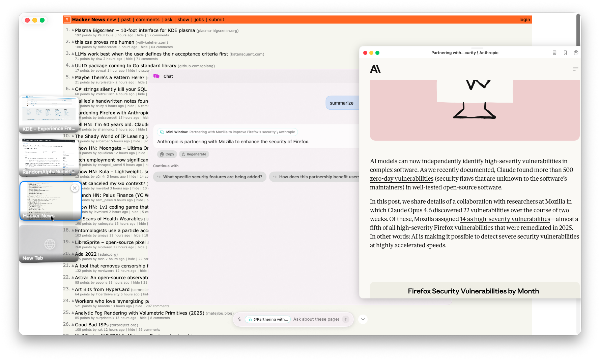

<div align="center">

# Wheel

**A browser that thinks with you.**

Wheel is a macOS browser with a built-in AI workflow layer: a multi-mode OmniBar, on-device chat and agents, semantic history search, workspace-aware tab state, and a blank-tab widget dashboard.




</div>

---

## What Wheel Does

### OmniBar

Wheel centers around one bottom-docked OmniBar with five modes. Press `Tab` or `Shift+Tab` to cycle.

| Mode | What it does |
|------|--------------|
| **Address** | Search, enter URLs, search history, and jump between tabs |
| **Chat** | Ask questions about the current page with full page context |
| **Semantic** | Search browsing history by meaning instead of keywords |
| **Agent** | Run multi-step browser tasks |
| **Reading List** | Search saved pages |

### Blank Tabs Become a Widget Dashboard

Opening a blank tab shows the current widget dashboard, not a static new-tab page.

- Widgets persist across launches
- The dashboard runs inside a single embedded `WKWebView` runtime
- Widget creation uses on-device generation plus deterministic templates for high-reliability cases like clocks
- Widgets can render local data or fetch public HTTPS data through an app-managed fetch bridge

### On-Device AI

Wheel uses Apple Intelligence through `FoundationModels` for chat, agent flows, and widget generation.

- No API keys required
- Page-aware chat with mention support
- Agent workflows integrated directly into browser state
- AI features are local to the machine; widgets may still call external APIs when their manifests require it

### Semantic Search

Wheel indexes pages locally and lets you search by concept.

- Powered by [VecturaKit](https://github.com/rryam/VecturaKit)
- Background indexing while you browse
- History, web, and reading-list context support

### Workspaces and Browser Tools

- Workspace-aware tab persistence and default agent configuration
- Reading List and Downloads built into the main UI
- Picture-in-Picture support
- Link previews and overlay windows from the browsing surface
- Tab wheel / middle-click panel for fast switching

### MCP and Headless Automation

Wheel can expose browser control over MCP and can also run headlessly.

- Built-in MCP server inside the app
- Separate `wheel-mcp-bridge` stdio target for MCP clients such as Claude Desktop
- Headless mode with configurable initial URL, MCP port, and window size

---

## Run It

### Development

```bash
git clone https://github.com/stevemurr/wheel.git
cd wheel/WheelBrowser
swift run WheelBrowser
```

### Build an App Bundle

```bash
cd WheelBrowser
make build
```

This produces:

```text
.build/arm64-apple-macosx/release/Wheel Browser.app
```

### Install to `/Applications`

```bash
cd WheelBrowser
make install
```

### Headless Mode

```bash
cd WheelBrowser
swift run WheelBrowser --headless --url https://example.com --port 8765 --window-size 1440x900
```

### MCP Bridge

```bash
cd WheelBrowser
swift run wheel-mcp-bridge
```

The bridge forwards MCP tool calls to the app's local MCP server.

---

## Requirements

- macOS 26+
- Apple Silicon
- Xcode 26+ / Swift 6.2 toolchain
- Apple Intelligence for on-device chat, agent, and widget generation features

The browser itself can still run without model availability, but AI-dependent features will be limited.

---

## Shortcuts

### Core

| Shortcut | Action |
|----------|--------|
| `Cmd+T` | New tab |
| `Cmd+W` | Close tab |
| `Cmd+Shift+S` | Toggle tab sidebar |
| `Cmd+Option+H` | Toggle auto-hide tab dock |
| `Cmd+L` | Focus address bar |
| `Cmd+Option+F` | Alternate address-bar focus |

### OmniBar and AI

| Shortcut | Action |
|----------|--------|
| `Tab` / `Shift+Tab` | Cycle OmniBar mode |
| `Cmd+K` | Focus AI chat |
| `Cmd+J` | Open semantic search |
| `Cmd+Shift+C` | Copy last response |
| `Cmd+Shift+R` | Regenerate response |
| `Cmd+Shift+E` | Edit last message |

### Navigation

| Shortcut | Action |
|----------|--------|
| `Cmd+R` | Reload |
| `Esc` | Stop loading |
| `Cmd+[` | Back |
| `Cmd+]` | Forward |
| `Cmd+F` | Find in page |
| `Cmd++` / `Cmd+=` | Zoom in |
| `Cmd+-` | Zoom out |
| `Cmd+0` | Reset zoom |

### Tabs and Tools

| Shortcut | Action |
|----------|--------|
| `Cmd+Shift+[` | Previous tab |
| `Cmd+Shift+]` | Next tab |
| `Cmd+Shift+T` | Reopen closed tab |
| `Cmd+1-9` | Switch to tab |
| `Cmd+S` | Save to reading list |
| `Cmd+B` | Show reading list |
| `Cmd+D` | Downloads |
| `Cmd+Shift+P` | Picture in Picture |
| `Cmd+Option+O` | Close all overlays |
| `Cmd+Option+W` | Show tab wheel |

---

## Tests

Run the main suite:

```bash
cd WheelBrowser
swift test
```

Run the opt-in live agent tests:

```bash
cd WheelBrowser
WHEEL_RUN_LIVE_AGENT_TESTS=1 swift test --filter AgentLiveTests
```

---

## Project Layout

The active architecture today is centered on these areas:

```text
WheelBrowser/
├── Sources/WheelBrowser/OmniBar/         # Multi-mode bottom command bar
├── Sources/WheelBrowser/Widgets/         # Current blank-tab widget platform
├── Sources/WheelBrowser/SemanticSearch/  # Local indexing and semantic retrieval
├── Sources/WheelBrowser/Agent/           # Browser agent execution
├── Sources/WheelBrowser/Shared/          # Shared infrastructure, including LLM integration
├── Sources/WheelBrowser/TopDrawer/       # Workspace management
├── Sources/WheelBrowser/MCP/             # In-app MCP server and settings
├── Sources/WheelBrowser/Headless/        # Headless browser startup/config
├── Sources/WheelBrowser/WebView/         # Web view container and browser plumbing
├── Sources/WheelBrowser/OverlayWindow/   # Overlay browser windows
├── Sources/WheelBrowser/LinkPreview/     # Hover/click preview system
├── Sources/WheelBrowser/Downloads/       # Download UI and state
└── Sources/WheelMCPBridge/               # MCP stdio bridge executable
```

There are still legacy `ModuleSystem/` and `WidgetSystem/` directories in the tree, but they are not the primary path for the current blank-tab widget dashboard.

---

<div align="center">

MIT License

</div>
