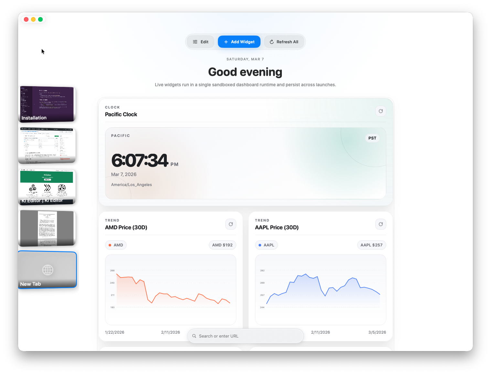

<div align="center">

# Wheel

**A macOS browser with a widget dashboard, semantic search, and local automation hooks.**


</div>

---

## What Wheel Does

Wheel is a macOS browser with a bottom-docked OmniBar, a blank-tab widget dashboard, local semantic search, workspace-aware tab state, built-in downloads and reading list tools, extension and ad-blocking support, and MCP/headless control paths for local automation.

### OmniBar

Wheel centers around one bottom-docked OmniBar with three currently enabled modes.

| Mode | What it does |
|------|--------------|
| **Address** | Search, enter URLs, search history, and jump between tabs |
| **Semantic** | Search browsing history by meaning instead of keywords |
| **Reading List** | Search saved pages |

### Blank Tabs Become a Widget Dashboard

Opening a blank tab shows the current widget dashboard, not a static new-tab page.

- Widgets persist across launches
- The dashboard runs inside a single embedded `WKWebView` runtime
- Widget creation uses the configured model provider plus deterministic templates for reliable cases like clocks and simple panels
- Widgets can render local data or fetch public HTTPS data through an app-managed fetch bridge



### AI Model, Settings Assistant, and Widget Generation

Wheel exposes model configuration in Settings instead of hard-coding a single provider.

- Provider selection for Apple, OpenAI, or vLLM
- Optional base URL and model ID configuration for remote providers
- API key storage in Keychain for providers that need it
- A Settings Assistant that can explain supported settings changes and preview them before confirmation
- Model-backed features are limited when no model is available

### Semantic Search

Wheel indexes pages locally and lets you search by concept.

- Powered by [VecturaKit](https://github.com/rryam/VecturaKit)
- Background indexing while you browse
- History and reading-list context support

### Workspaces, Extensions, and Browser Tools

- Workspace-aware tab persistence and default workspace configuration
- Reading List and Downloads built into the main UI
- Picture-in-Picture and Reader Mode controls
- Link previews and overlay windows from the browsing surface
- Tab wheel / middle-click panel for fast switching
- Extension runtime with ad-blocking lists and refresh controls

### MCP and Headless Control

Wheel can expose browser control over MCP and can also run headlessly.

- Built-in MCP server inside the app
- Separate `wheel-mcp-bridge` stdio target for MCP clients such as Claude Desktop
- Headless mode with configurable initial URL, MCP port, and window size

---

## Run It

### Development

```bash
git clone https://github.com/stevemurr/wheel.git
cd wheel/WheelBrowser
swift run WheelBrowser
```

### Build an App Bundle

```bash
cd WheelBrowser
make build
```

This produces:

```text
.build/arm64-apple-macosx/release/Wheel Browser.app
```

### Install to `/Applications`

```bash
cd WheelBrowser
make install
```

### Headless Mode

```bash
cd WheelBrowser
swift run WheelBrowser --headless --url https://example.com --port 8765 --window-size 1440x900
```

### MCP Bridge

```bash
cd WheelBrowser
swift run wheel-mcp-bridge
```

Enable the MCP server in Wheel's Settings before using the bridge. The bridge forwards MCP tool calls to the app's local MCP server.

---

## Requirements

- macOS 26+
- Apple Silicon
- Xcode 26+ / Swift 6.2 toolchain
- Optional model access for widget generation and the Settings Assistant

Apple uses `FoundationModels` / Apple Intelligence when available. OpenAI and vLLM require endpoint configuration, and OpenAI requires an API key.

The browser itself can still run without model availability, but model-backed features will be limited.

---

## Shortcuts

### Core

| Shortcut | Action |
|----------|--------|
| `Cmd+T` | New tab |
| `Cmd+W` | Close tab |
| `Cmd+Shift+S` | Toggle tab sidebar |
| `Cmd+Option+H` | Toggle auto-hide tab dock |

### Search and Lists

| Shortcut | Action |
|----------|--------|
| `Cmd+L` | Focus address bar |
| `Cmd+Option+F` | Alternate address-bar focus |
| `Cmd+J` | Open semantic search |
| `Cmd+S` | Save to reading list |
| `Cmd+B` | Show reading list |

### Navigation

| Shortcut | Action |
|----------|--------|
| `Cmd+R` | Reload |
| `Cmd+Shift+R` | Toggle Reader Mode |
| `Esc` | Stop loading |
| `Cmd+[` | Back |
| `Cmd+]` | Forward |
| `Cmd+F` | Find in page |

### Tabs and Panels

| Shortcut | Action |
|----------|--------|
| `Cmd+Shift+[` | Previous tab |
| `Cmd+Shift+]` | Next tab |
| `Cmd+Shift+T` | Reopen closed tab |
| `Cmd+1-9` | Switch to tab |
| `Cmd+D` | Downloads |
| `Cmd+Option+O` | Close all overlays |
| `Cmd+Option+W` | Show tab wheel |

### View and Media

| Shortcut | Action |
|----------|--------|
| `Cmd++` / `Cmd+=` | Zoom in |
| `Cmd+-` | Zoom out |
| `Cmd+0` | Reset zoom |
| `Cmd+Shift+P` | Picture in Picture |

---

## Tests

Run the main suite:

```bash
cd WheelBrowser
swift test
```

Run the opt-in live browser automation tests:

```bash
cd WheelBrowser
WHEEL_RUN_LIVE_AGENT_TESTS=1 swift test --filter AgentLiveTests
```

---

## Project Layout

The active architecture today is centered on these areas:

```text
WheelBrowser/
├── Sources/WheelBrowser/Core/            # Product gating and shared browser experience flags
├── Sources/WheelBrowser/OmniBar/         # Address/search surface plus semantic and reading-list panels
├── Sources/WheelBrowser/Widgets/         # Blank-tab widget dashboard and manifest generation
├── Sources/WheelBrowser/SemanticSearch/  # Local indexing, embeddings, and retrieval
├── Sources/WheelBrowser/Settings/        # Model configuration, extensions, MCP, and assistant UI
├── Sources/WheelBrowser/TopDrawer/       # Workspaces and tab restoration
├── Sources/WheelBrowser/WebView/         # Web view container and browser plumbing
├── Sources/WheelBrowser/Extensions/      # Extension loading and content blocker integration
├── Sources/WheelBrowser/MCP/             # In-app MCP server and shared tool definitions
├── Sources/WheelBrowser/Headless/        # Headless browser startup and configuration
├── Sources/WheelBrowser/Downloads/       # Download UI and state
├── Sources/WheelBrowser/OverlayWindow/   # Overlay browser windows and previews
├── Sources/WheelBrowser/RightClickPanel/ # Tab wheel / middle-click switcher
└── Sources/WheelMCPBridge/               # MCP stdio bridge executable
```

---

## License

Wheel is available under the [Wheel Noncommercial Share Source License 1.0](./LICENSE).

- Forking, use, modification, and redistribution are allowed for noncommercial purposes.
- If you share a fork or modified version with anyone else, you must publish the complete corresponding source code under the same license.
- Commercial use requires prior written permission from the copyright holder.

Because commercial use is restricted, this license is source-available, not OSI open source.
